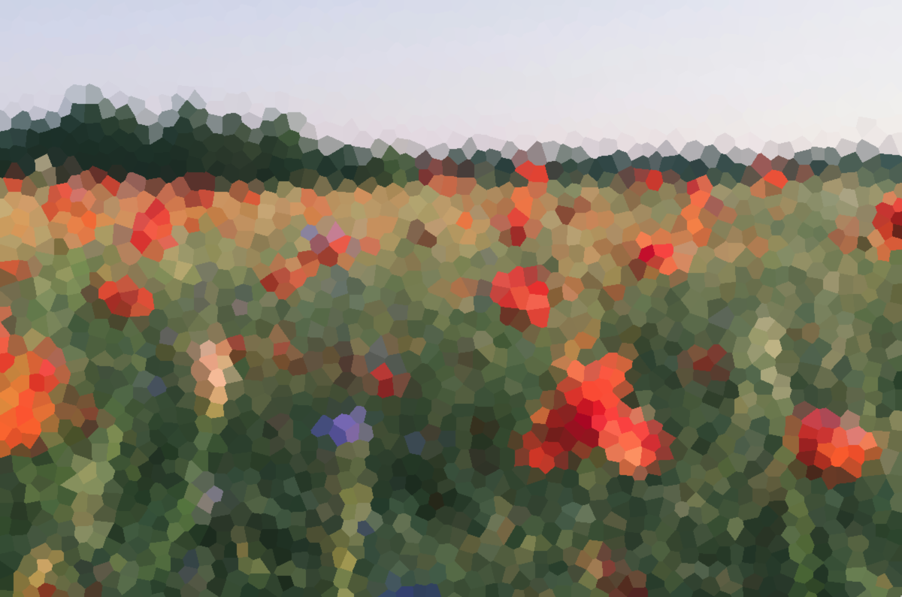

# Voronoi Wallpaper

An application for creating wallpapers using the [Voronoi Diagram](https://en.wikipedia.org/wiki/Voronoi_diagram).

## Example


Becomes



## Building

To build, [raylib](https://www.raylib.com/) must be installed

```sh
make
```

## Running

```sh
./main <image>
```
